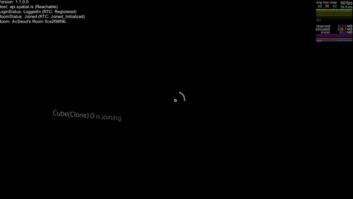
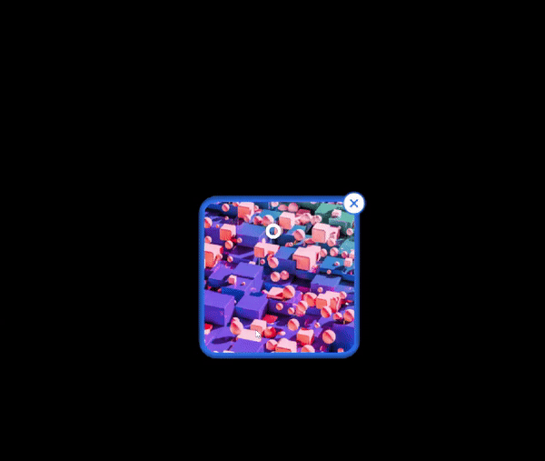

# Sehyun Av Kim

Hi, I'm Sehyun Kim (also known as ‘av’ or ‘avseoul’). I am a computer graphics artist from Seoul, Korea.

I love things that are raw, bold, and rough but that are not indigested or distracted. I also love things that are sophisticated, elaborated, and refined but that are not boring or indistinctive.

I design and implement **realtime visual effects**, **animations**, and **interactions** for **AR/VR/MR/Web** experience on various platforms that range from **Microsoft Hololens**, **Oculus Quest**, **iOS**, **Android**, to **Web browsers** with **Unity**, **Threejs (WebGL)**, and **RealityKit**.

In my free time, I enjoy creating realtime WebGL sketches as hobby projects and also as technical explorations.

Currently, I'm a technical artist at Marcom, Creative Tech at Apple.

[Resume](https://docs.google.com/document/d/1U_0qwoadvwsV9x-FkS7Bj1ODvtJ5vnsinRwrHzDMlVI/edit?usp=sharing)
[LinkedIn](https://www.linkedin.com/in/avseoul/)
[realtime WebGL sketches](https://www.instagram.com/avseoul/)

---

## Works at Apple

**Technical Artist** @Marcom, Creative Tech from *2022 Jan* to *present*  

- Prototyping AR experience for retail store experience with RealityKit and Unity3D
- Look development

**Contracted Creative Technologist** @Marcom, Creative Tech from *2021 Jun* to *2022 Jan*  

- Responsible for WebGL and localization parts for Airpods Max retail store experience

**Above links are only accessible from Apple's private network*

---

## Works at Spatial

**Creative Technologist** @[Spatial](https://spatial.io/) from *2018* to *2021 Jun*

- Responsible for designing and implementing **realtime visual effects**, **animations**, and **interactions** for **AR/VR/MR/Web** experience on various platforms that range from **Microsoft Hololens**, **Oculus Quest**, **iOS**, **Android**, to **Web browsers** with **Unity**, **Threejs (WebGL)**.

Spatial is a start up and it was even smaller when I was in. So the usual working process is starting with a simple need/idea/direction.

I start with it and come up with some variations of quick working prototype. Sometimes, I use sketches or pre-rendered animations, but most of time, the working prototype works the most efficiently with less chance of miscommunications, especially for immersive experience, which is hard to demonstrate the idea in 2D.

Followings are some of features that I designed and developed:

### 3D Object Transition Effects

 

#### What

A transition effects for 3d objects res-in/out.

#### How it works

1. Batched triangles(particles) are generated based on the given target meshes triangles
2. Transform of the triangles are computed in compute shader, encoded to a compute buffer
3. Computed transform data is applied in vertex shader pass
4. Lighting is applied in fragment shader pass:
    1. Target meshes vertex attributes are encoded into ** this compute buffer as well and used for looking up target meshes rendering parameters to match up the initial look when the transition begins

Implemented with Unity3D, runs on Quest 1, 2, iOS/Android devices.

#### Design iteration

   

---

### Clapping & Fistbump Effects

  

#### What

It is a playful experience that is only possible in virtual immersive space. But not only that, it also helps to make stronger connection between physical world and virtual world. By you perform a very familiar human interaction as you do in real life with virtual avatars (it work both ways), which gives you sensory feedback.

Implemented with Unity3D, runs on Hololens 2, Quest 1, 2, iOS/Android devices.

---

### 3D Scribble

  

#### What

A 3D scribbling in immersive environment.

Dynamic mesh generation in runtime:

- A flat strip mesh is used for a better performance for hololens
- Surface direction is defined by direction delta between current and previous input in order to prevent scribble meshes being too flat on certain angle

Implemented with Unity3D, runs on Hololens 1, 2, Quest 1, 2.

  

---

### Selfie Stick

 

#### What

A screen capture module in a selfie stick form, providing a playful experience yet serving the purpose

Implemented with Unity3D, runs on Quest 1, 2.

---

### Configurable Button & Tangible Touch Interaction

   

*What it is?*
A configurable button module with tangible interaction

*Target Platforms*

- Oculus Quest 1,2,  Hololens 1,2

### Work Board

 
 

### Gaze Hint

 

### Object Highlighter

 

### 3D Elastic Tooltip

### Avatar Loading View

  

#### What

A view for avatar loading state. It is implemented with Threejs so it renders realtime in order to seamlessly transition into the generated/loaded avatar.

Implemented with Threejs, runs on desktop/mobile web browsers.

#### Design iterations

*Design passes with prerendered animations)*  
 

---

### Space Portal

 
*What it is?*
Prototyping a space portal

- Target space is capture as a cubemap and map to the portal sphere
- The portal sphere is backface rendered to create 3D space portal illusion (3D parallax)

*Target Platforms*

- Oculus Quest1, 2

### Runtime Lightmap Transition

*What it is?*
Prototyping a simple lightmap transition system to express different time of a day in VR

*Target Platforms*

- Oculus Quest1, 2

## Technical Exploration

### Custom Spring Physics & Confetti Particle System

 
*What it is?*

- A technical exploration in VR with spring physics for sling shot to trigger confetti like particles
- Implemented with Unity3D/Oculus Rift

### Fluid Simulation

  -1945.gif)  

*What it is?*

- A technical exploration in particle system based on fluid simulation
- Implemented with Cinder with Nvidia Flex library for fluid simulation

### Ray Marching & Metaball

*What it is?*

- A technical exploration in ray marching and metaball
- Implemented based on Inigo Quilez’s metaball (<https://www.shadertoy.com/view/ld2GRz>)
- Extra small particles are actual geometries, they are composed in a composition shader pass with ray marched metaball pass with manual depth testing
- Implemented with Unity3D

### Sphere Collision Detection & Screen Space Reflection

  

*What it is?*

- A technical exploration in sphere collision test and screen space reflection
- GPU driven particle system, particle’s transform parameters are computed in compute shader and applied to batched spheres
- Naive brute force collision test in compute shader
- Implemented with Unity3D

### Procedural PBR textures & Subsurface Scattering

*What it is?*

- A technical exploration in lookdev with procedurally generated textures for PBR lighting and subsurface scattering
- Roughness map is generated from 2D noise pattern, the roughness map can be considered as an inverted height map by assuming the surface of the sphere is perfectly smooth, a tangent space normal map can be generated from the height map by comparing neighbor’s height
- Implemented with Threejs

## Personal Works

.gif)
.gif)
.gif)

### Walk

*What it is?*

- Demo available via avseoul.net/walk (<http://avseoul.net/walk>) (*Currently not working on Safari due to OffScreenCanvas (<https://developer.mozilla.org/en-US/docs/Web/API/OffscreenCanvas>) API that I use in this sketch, not supported in Safari. Tested with Chrome)
- The rendering is based on Threejs PBR lighting but slightly modified since I do deferred shading due to no transparency in the scene and most of the additional rendering techniques that I applied are in screen space. I also do a custom skinned mesh animation that is modified from the Threejs.
- Threejs skinning is done in vertex shader pass of when the skinned mesh is rendered, so the modified vertex position is not accessible from in other passes. So I had to get around by encoding the skinned mesh vertex attributes and skinning attributes to textures, computing the skinning in an extra shader pass, export the skinned position, normal, and tangent to textures.
- So in the vertex shader pass of the skinned mesh only looks up those textures by vertex index, and applies the values to their vertex attributes. This enables me to glitch the model easily. What I did was, just give a little bit of random shuffle and offset to the texture coordinates for sampling skinning textures, so the skinning attributes are applied to the incorrect vertex.
- Particle systems reference those skinned positions and normals as well for their emitting position and forces. (Particle systems are pre-batched cubes and quads driven by textures in shader passes in order to draw them in less draw calls. I use extra texture coordinate channels to store the index of those individual cube and quad in order to distinguish them in the same shader pass)
- Implemented with Threejs

Etc.
